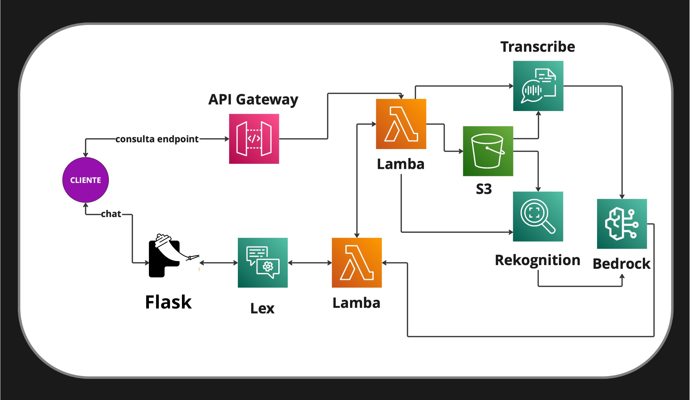
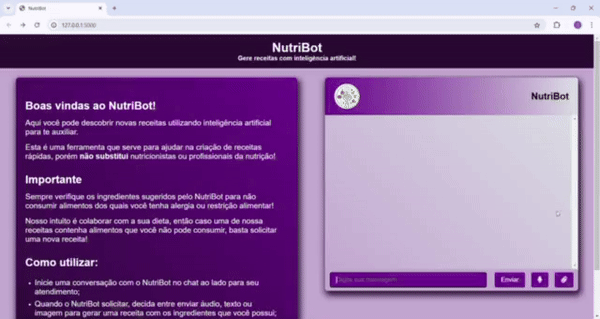

# NutriBot 🍎🤖

O **NutriBot** é uma aplicação inovadora que ajuda profissionais de nutrição a criar receitas rápidas e personalizadas usando inteligência artificial. A partir de fotos, áudios ou textos enviados pelos pacientes, o NutriBot utiliza tecnologias avançadas da AWS para identificar ingredientes e sugerir receitas baseadas nesses dados.

## 🖼️ Arquitetura do Projeto



## 🚀 Funcionalidades

- **Identificação de Ingredientes via Foto**: Utilize o Amazon Rekognition para identificar os ingredientes presentes em imagens enviadas pelos pacientes.
- **Processamento de Áudio**: Converta áudios para texto com o Amazon Transcribe para capturar os ingredientes mencionados.
- **Criação de Receitas Personalizadas**: Use o Amazon Bedrock para gerar receitas únicas com base nos ingredientes identificados.
- **Chat Interativo**: Converse com o NutriBot via Slack, recebendo receitas diretamente pelo chat.
- **Integração Completa com AWS**: Implementação com Lambda, API Gateway, S3, Rekognition, Transcribe e Bedrock.

## 👀 Preview



## 🛠️ Tecnologias Utilizadas

- **Back-end**:
  - AWS Lambda para lógica de negócio.
  - Flask API para criar endpoints REST.
- **Processamento de Dados**:
  - Amazon Rekognition para análise de imagens.
  - Amazon Transcribe para transcrição de áudios.
  - Amazon Bedrock para geração de receitas com IA.
- **Armazenamento**:
  - Amazon S3 para armazenamento de arquivos (imagens e transcrições).
- **Interface de Chat**:
  - Amazon Lex para comunicação interativa.
  - Interface HTML

## 📂 Estrutura do Repositório

```
.
├── assets/
│   ├── arquitetura-base.jpg
├── bot/
│   ├── BotNutri-1-YVI1...
│   ├── BotNutri-2-GS7...
│   └── Versão-final.zip
├── lambda/
│   ├── intents/
│   │   ├── audio.py
│   │   ├── confirmacaoafirmativa.py
│   │   ├── confirmacaonegativa.py
│   │   ├── enviarfoto.py
│   │   ├── kcal.py
│   │   ├── novosnomes.py
│   │   ├── opcoes.py
│   │   ├── saudacao.py
│   │   ├── texto.py
│   │   ├── filtro.py
│   │   ├── gpt.py
│   │   ├── lambda_function.py
│   │   └── tradutor.py
├── static/
│   ├── assets/
│   │   ├── NutriLogo.ico
│   │   └── NutriLogo.png
│   ├── main.js
│   └── style.css
├── templates/
│   └── index.html
├── app.py
├── Dockerfile
├── README.md
└── requirements.txt
```

### Descrição das Pastas

- **`assets/`**: Contém imagens e outros recursos auxiliares.
- **`bot/`**: Contém diferentes versões do bot NutriBot compactadas.
- **`lambda/`**: Armazena os códigos das funções Lambda organizados na subpasta `intents`.
- **`static/`**: Contém arquivos estáticos como imagens, JavaScript e CSS.
- **`templates/`**: Guarda os templates HTML do projeto.
- **`app.py`**: Arquivo principal para inicialização do Flask.
- **`Dockerfile`**: Configuração para criação da imagem Docker.
- **`requirements.txt`**: Lista de dependências do Python para o projeto.

## 🏁 Como Executar o Projeto

1. **Clone o repositório**:
   ```bash
   git clone https://github.com/Compass-pb-aws-2024-JUNHO/sprints-9-10-pb-aws-junho.git
   cd sprints-9-10-pb-aws-junho
   ```

2. **Instale as dependências**:
   - Certifique-se de ter o [Serverless Framework](https://www.serverless.com/) instalado.
   - Configure suas credenciais AWS no ambiente.

3. **Deploy do projeto**:
   ```bash
   serverless deploy
   ```

4. **Testar o Bot no com Flask**:
   ```
   python app.py
   ```

## 🌟 Autores

<a href="https://github.com/CarlosCatao">Carlos Catao</a><br>
<a href="https://github.com/Erick8874">Erick Felix</a><br>
<a href="https://github.com/fredMelchior">Fred Melchior</a><br>
<a href="https://github.com/Macedorael">Israel Macedo</a><br>
<a href="https://github.com/Paulo-Henrique06">Paulo Henrique</a>